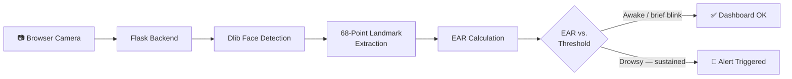

<div align="center">

# 🚗 **AI Driver Drowsiness Detection System**


<br/>

[](https://smart-driver-monitor.onrender.com)

<br/>

[](https://python.org)
[](https://flask.palletsprojects.com)
[](https://opencv.org)
[](http://dlib.net)

<br/>

> ⚡ **Real-time fatigue detection using facial landmarks + Eye Aspect Ratio (EAR) algorithm.**
> Monitors driver alertness through a live browser camera feed and raises an alert when signs of drowsiness sustain.

> ⚠️ *Free Render server may take **30–50 seconds** to wake up on first visit.*

</div>

---

## 📑 Table of Contents

- [Preview](#-preview)
- [Key Features](#-key-features)
- [How It Works](#-how-it-works)
- [Detection Formula](#-detection-formula)
- [Project Structure](#️-project-structure)
- [Tech Stack](#️-tech-stack)
- [Getting Started](#-getting-started)
- [Deployment on Render](#️-deployment-on-render)
- [Use Cases](#-use-cases)
- [Roadmap](#-roadmap)
- [Disclaimer](#️-disclaimer)
- [Author](#-author)

---

## 🖼️ Preview

<div align="center">

| Awake / Monitoring | Blink Detected |
|:---:|:---:|
|  |  |
| Normal state — EAR stays above threshold, dashboard shows all-clear | Brief EAR dip from a natural blink — correctly ignored, no alert |

| Drowsiness Alert | Facial Landmark Detection |
|:---:|:---:|
|  |  |
| Sustained low EAR — alarm triggers and dashboard flags the driver | 68-point Dlib landmarks with the 6 eye points used in the EAR calculation |

</div>

> 📸 Drop your own captures into `docs/screenshots/` using the filenames above (recommended: **1280×800px, PNG**) and they'll render automatically here. Since this is a single live dashboard rather than multiple pages, these four capture it in its four key states — you can grab them straight from the live demo.

---

## ✨ Key Features

<table>
<tr>
<td>

**👁️ Eye Tracking**
- Eye Aspect Ratio (EAR) algorithm
- 68-point facial landmark detection
- Real-time blink vs. drowsiness classification

</td>
<td>

**📡 Live Monitoring**
- WebRTC browser camera integration
- Continuous Flask API frame processing
- Instant dashboard updates

</td>
</tr>
<tr>
<td>

**🚨 Smart Alerts**
- Automatic drowsiness alerts
- Customizable EAR thresholds
- Audio alarm on detection

</td>
<td>

**☁️ Cloud Ready**
- Deployed on Render
- Easy GitHub integration
- Scalable architecture

</td>
</tr>
</table>

---

## 🧠 How It Works



1. 📷 **Capture** — Browser streams live video via WebRTC
2. 📤 **Send** — Frames sent to Flask backend in real-time
3. 🧍 **Detect** — Dlib identifies 68 facial landmark points
4. 📐 **Calculate** — Eye Aspect Ratio (EAR) is computed per frame
5. ⚖️ **Compare** — EAR vs. threshold determines alertness
6. 🚨 **Alert** — Sustained low EAR triggers immediate notification
7. 📊 **Update** — Live dashboard reflects driver status

---

## 📊 Detection Formula

<div align="center">

### Eye Aspect Ratio (EAR)

```
EAR = (||p2 − p6|| + ||p3 − p5||) / (2 × ||p1 − p4||)
```

</div>

| Status | Condition | Action |
|:------:|:---------:|:------:|
| ✅ **Awake** | EAR ≥ threshold | Continue monitoring |
| 😑 **Blinking** | EAR < threshold (brief) | Normal — ignored |
| 😴 **Drowsy** | EAR < threshold (sustained) | 🚨 Alert triggered |

---

## 🏗️ Project Structure

```
driver-drowsiness-detection-system/
│
├── 📄 app.py                    # Flask application entry point
├── 📋 requirements.txt          # Python dependencies
├── ⚙️  Procfile                  # Render deployment config
├── 🐍 .python-version           # Python version pin
│
├── 🧠 models/
│   └── shape_predictor_68_face_landmarks.dat   # Dlib landmark model
│
├── 🔧 src/
│   └── ear.py                   # EAR calculation logic
│
├── 🌐 templates/
│   └── index.html               # Frontend dashboard
│
├── 🔊 static/
│   └── alarm.wav                # Drowsiness alert audio
│
├── 📸 docs/
│   └── screenshots/              # Preview images (see Preview section)
│
└── 📖 README.md
```

---

## ⚙️ Tech Stack

| Layer | Technology |
|:------|:-----------|
| 🖥️ Backend | Python · Flask · Gunicorn |
| 👁️ Vision | OpenCV · Dlib · NumPy |
| 🌐 Frontend | HTML · CSS · JavaScript |
| 📡 Streaming | WebRTC |
| ☁️ Deployment | Render Cloud |

---

## 🚀 Getting Started

### 1️⃣ Clone the Repository

```bash
git clone https://github.com/yashrajagawane/driver-drowsiness-detection-system.git
cd driver-drowsiness-detection-system
```

### 2️⃣ Create & Activate Virtual Environment

```bash
# Create
python -m venv venv

# Activate — Windows
venv\Scripts\activate

# Activate — macOS / Linux
source venv/bin/activate
```

### 3️⃣ Install Dependencies

```bash
pip install -r requirements.txt
```

### 4️⃣ Run the App

```bash
python app.py
```

### 5️⃣ Open in Browser

```
http://127.0.0.1:5000
```

---

## ☁️ Deployment on Render

| Step | Action |
|:----:|:-------|
| 1 | Push your code to GitHub |
| 2 | Create a new **Web Service** on [Render](https://render.com) |
| 3 | Connect your GitHub repository |
| 4 | Set **Build Command** → `pip install -r requirements.txt` |
| 5 | Set **Start Command** → `gunicorn app:app` |
| 6 | Deploy 🚀 |

---

## 🎯 Use Cases

- 🚗 **Personal vehicle** driver safety systems
- 🚛 **Fleet management** — monitor commercial drivers
- 🤖 **AI research** — fatigue & attention modeling
- 🚘 **Smart vehicles** — ADAS integration

---

## 🔮 Roadmap

- [ ] 🧠 Deep learning-based fatigue classification
- [ ] 🙆 Head pose & nodding detection
- [ ] 👁️ Blink rate analysis over time
- [ ] 📱 Mobile device optimization
- [ ] 👥 Multi-driver detection support
- [ ] 📊 Session-based drowsiness reports

---

## ⚠️ Disclaimer

This project is a research and educational prototype demonstrating real-time drowsiness detection with computer vision. It is **not a certified safety device** and hasn't been validated against automotive safety standards. It should be treated as a supplementary tool at most — never as a driver's sole line of defense against fatigue while on the road.

---

<div align="center">

## 👨‍💻 Author

**Yashraj Agawane**

[](https://github.com/yashrajagawane)

---

### ⭐ Found this helpful?

**Star the repo** — it takes one click and means a lot!

[](https://github.com/yashrajagawane/driver-drowsiness-detection-system)

<br/>

*Built with ❤️ to make roads safer*

</div>
