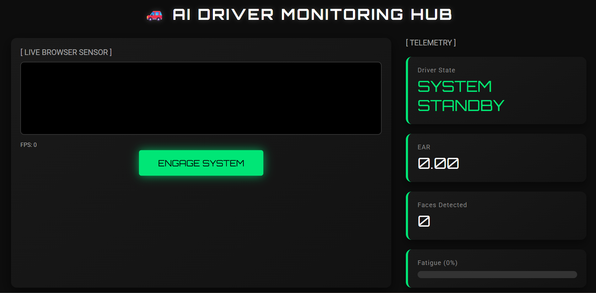
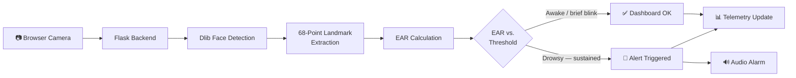

<a name="readme-top"></a>

<div align="center">

# 🚗 AI Driver Drowsiness Detection System

### Real-Time Fatigue Monitoring Powered by Computer Vision
<br/>

[](https://smart-driver-monitor.onrender.com)
[](https://github.com/yashrajagawane/driver-drowsiness-detection-system/stargazers)

<br/>

[](https://python.org)
[](https://flask.palletsprojects.com)
[](https://opencv.org)
[](http://dlib.net)
[](https://render.com)

<br/>

[](https://github.com/yashrajagawane/driver-drowsiness-detection-system/issues)
[](https://github.com/yashrajagawane/driver-drowsiness-detection-system/network/members)
[](https://github.com/yashrajagawane/driver-drowsiness-detection-system/commits)
[](CONTRIBUTING.md)

<br/>

> ⚡ **Real-time fatigue detection using facial landmarks + Eye Aspect Ratio (EAR) algorithm.**
> Monitors driver alertness through a live browser camera feed and raises an alert the moment signs of drowsiness sustain — no extra hardware required, just a webcam and a browser.

> ⚠️ *Free Render tier may take **30–50 seconds** to spin up on first visit — subsequent loads are fast.*

</div>

---

## 📑 Table of Contents

- [Preview](#️-preview)
- [Why This Project Stands Out](#-why-this-project-stands-out)
- [Key Features](#-key-features)
- [How It Works](#-how-it-works)
- [Detection Formula](#-detection-formula)
- [Project Structure](#️-project-structure)
- [Tech Stack](#️-tech-stack)
- [Getting Started](#-getting-started)
- [Configuration](#-configuration)
- [Deployment on Render](#️-deployment-on-render)
- [Roadmap](#-roadmap)
- [Author](#-author)

---

## 🖼️ Preview

<div align="center">



**AI Driver Monitoring Hub — standby state**
*A dark, HUD-style control panel showing the live camera feed on the left and real-time EAR / driver-state telemetry on the right, ready to engage with a single click.*

</div>

The dashboard is built as a dark, HUD-style control panel split into two halves. On the left, a **`[ LIVE BROWSER SENSOR ]`** panel holds the camera feed viewport (idle and black until the feed is engaged), an **FPS** counter beneath it for tracking frame throughput, and a glowing **`ENGAGE SYSTEM`** button that starts capture. On the right, a **`[ TELEMETRY ]`** panel streams live stats in individually bordered cards: **Driver State** (currently reading `SYSTEM STANDBY` in large green terminal-style text), the live **EAR** value, and a **Faces Detected** counter — each card accented with a neon-green left border that echoes the "awake/alert" color language used throughout the UI. Once `ENGAGE SYSTEM` is clicked, the feed populates and these values update in real time as EAR is computed per frame.

> 📸 Save your own capture as `docs/screenshots/dashboard.png` (recommended: **1280×800px, PNG**) — grab it straight from the live demo. Consider adding a second screenshot showing the "drowsy" alert state for extra visual impact.

<p align="right"><a href="#readme-top">back to top ⬆️</a></p>

---

## 🌟 Why This Project Stands Out

- **Zero extra hardware** — runs entirely off a standard webcam, no IR sensors or wearables needed.
- **Browser-native capture** — WebRTC streams video straight from the client, keeping setup friction low.
- **Explainable detection** — built on the well-established EAR algorithm rather than a black-box model, so every alert is traceable back to a geometric measurement.
- **Deploy-ready** — ships with a `Procfile` and Gunicorn config, so it's one click away from a live Render deployment.
- **Actively evolving** — see the [Roadmap](#-roadmap) for planned deep-learning and multi-driver upgrades.

<p align="right"><a href="#readme-top">back to top ⬆️</a></p>

---

## ✨ Key Features

<table>
<tr>
<td width="50%">

**👁️ Eye Tracking**
- Eye Aspect Ratio (EAR) algorithm
- 68-point facial landmark detection
- Real-time blink vs. drowsiness classification

</td>
<td width="50%">

**📡 Live Monitoring**
- WebRTC browser camera integration
- Continuous Flask API frame processing
- Instant dashboard updates with FPS tracking

</td>
</tr>
<tr>
<td width="50%">

**🚨 Smart Alerts**
- Automatic drowsiness alerts
- Customizable EAR thresholds
- Audio alarm on detection

</td>
<td width="50%">

**☁️ Cloud Ready**
- Deployed on Render
- Easy GitHub integration
- Scalable, stateless Flask architecture

</td>
</tr>
</table>

<p align="right"><a href="#readme-top">back to top ⬆️</a></p>

---

## 🧠 How It Works



1. 📷 **Capture** — Browser streams live video via WebRTC
2. 📤 **Send** — Frames are sent to the Flask backend in real time
3. 🧍 **Detect** — Dlib identifies 68 facial landmark points
4. 📐 **Calculate** — Eye Aspect Ratio (EAR) is computed per frame
5. ⚖️ **Compare** — EAR is checked against the configured threshold
6. 🚨 **Alert** — Sustained low EAR over consecutive frames triggers the audio alarm
7. 📊 **Update** — The live dashboard reflects the current driver state, EAR value, and face count

<p align="right"><a href="#readme-top">back to top ⬆️</a></p>

---

## 📊 Detection Formula

<div align="center">

### Eye Aspect Ratio (EAR)

```
EAR = (‖p2 − p6‖ + ‖p3 − p5‖) / (2 × ‖p1 − p4‖)
```

*Where p1–p6 are the six 2D facial landmark coordinates around a single eye.*

</div>

| Status | Condition | Action |
|:------:|:---------:|:------:|
| ✅ **Awake** | EAR ≥ threshold | Continue monitoring |
| 😑 **Blinking** | EAR < threshold (brief, few frames) | Normal — ignored |
| 😴 **Drowsy** | EAR < threshold (sustained across consecutive frames) | 🚨 Alert triggered |

<p align="right"><a href="#readme-top">back to top ⬆️</a></p>

---

## 🏗️ Project Structure

```
driver-drowsiness-detection-system/
│
├── 📄 app.py                    # Flask application entry point
├── 📋 requirements.txt          # Python dependencies
├── ⚙️  Procfile                  # Render deployment config
├── 🐍 .python-version           # Python version pin
│
├── 🧠 models/
│   └── shape_predictor_68_face_landmarks.dat   # Dlib landmark model
│
├── 🔧 src/
│   └── ear.py                   # EAR calculation logic
│
├── 🌐 templates/
│   └── index.html               # Frontend dashboard
│
├── 🔊 static/
│   └── alarm.wav                # Drowsiness alert audio
│
├── 📸 docs/
│   └── screenshots/              # Preview images (see Preview section)
│
└── 📖 README.md
```

<p align="right"><a href="#readme-top">back to top ⬆️</a></p>

---

## ⚙️ Tech Stack

| Layer | Technology |
|:------|:-----------|
| 🖥️ Backend | Python · Flask · Gunicorn |
| 👁️ Vision | OpenCV · Dlib · NumPy |
| 🌐 Frontend | HTML · CSS · JavaScript |
| 📡 Streaming | WebRTC |
| ☁️ Deployment | Render Cloud |

<p align="right"><a href="#readme-top">back to top ⬆️</a></p>

---

## 🚀 Getting Started

### Prerequisites

- Python 3.x
- `pip` and `venv`
- A webcam and a modern browser (for WebRTC support)

### 1️⃣ Clone the Repository

```bash
git clone https://github.com/yashrajagawane/driver-drowsiness-detection-system.git
cd driver-drowsiness-detection-system
```

### 2️⃣ Create & Activate a Virtual Environment

```bash
# Create
python -m venv venv

# Activate — Windows
venv\Scripts\activate

# Activate — macOS / Linux
source venv/bin/activate
```

### 3️⃣ Install Dependencies

```bash
pip install -r requirements.txt
```

### 4️⃣ Run the App

```bash
python app.py
```

### 5️⃣ Open in Browser

```
http://127.0.0.1:5000
```

Click **`ENGAGE SYSTEM`** on the dashboard to grant camera access and start monitoring.

<p align="right"><a href="#readme-top">back to top ⬆️</a></p>

---

## 🛠️ Configuration

Fine-tune detection behavior in `src/ear.py` (or via environment variables, if you wire them up):

| Parameter | Description | Typical Value |
|:----------|:-------------|:--------------|
| `EAR_THRESHOLD` | EAR value below which an eye is considered "closed" | `0.25` |
| `CONSECUTIVE_FRAMES` | Number of consecutive low-EAR frames required to trigger an alert | `20–30` |
| `CAMERA_FPS` | Target frame rate for capture/processing | Depends on hardware |

> 💡 Lower thresholds reduce false positives from normal blinking but may delay real drowsiness detection — tune based on your camera and lighting conditions.

<p align="right"><a href="#readme-top">back to top ⬆️</a></p>

---

## ☁️ Deployment on Render

| Step | Action |
|:----:|:-------|
| 1 | Push your code to GitHub |
| 2 | Create a new **Web Service** on [Render](https://render.com) |
| 3 | Connect your GitHub repository |
| 4 | Set **Build Command** → `pip install -r requirements.txt` |
| 5 | Set **Start Command** → `gunicorn app:app` |
| 6 | Deploy 🚀 |

<p align="right"><a href="#readme-top">back to top ⬆️</a></p>

---

## 🎯 Use Cases

- 🚗 **Personal vehicle** driver safety systems
- 🚛 **Fleet management** — monitor commercial drivers
- 🤖 **AI research** — fatigue & attention modeling
- 🚘 **Smart vehicles** — ADAS integration
- 🎓 **Education** — a hands-on computer vision teaching example

<p align="right"><a href="#readme-top">back to top ⬆️</a></p>

---

## 🔮 Roadmap

- [ ] 🧠 Deep learning-based fatigue classification
- [ ] 🙆 Head pose & nodding detection
- [ ] 👁️ Blink rate analysis over time
- [ ] 📱 Mobile device optimization
- [ ] 👥 Multi-driver detection support
- [ ] 📊 Session-based drowsiness reports
- [ ] 🔔 Configurable alert channels (SMS/push notifications)
- [ ] 🗣️ Yawn detection as a secondary fatigue signal

Have an idea? Open an issue or start a discussion — contributions and suggestions are welcome.

<p align="right"><a href="#readme-top">back to top ⬆️</a></p>

---

## 🤝 Contributing

Contributions make the open-source community a great place to learn and build. Any contribution is **greatly appreciated**.

1. Fork the repository
2. Create your feature branch (`git checkout -b feature/AmazingFeature`)
3. Commit your changes (`git commit -m 'Add some AmazingFeature'`)
4. Push to the branch (`git push origin feature/AmazingFeature`)
5. Open a Pull Request

Don't forget to ⭐ **star the repo** if you found it useful!

<p align="right"><a href="#readme-top">back to top ⬆️</a></p>

---

## ❓ FAQ

**Does it work with glasses?**
Dlib's 68-point landmark model generally handles glasses reasonably well, though heavy glare or reflective lenses can reduce landmark accuracy — good, even lighting helps.

**Does it need internet access to run locally?**
No — once dependencies and the landmark model are downloaded, the app runs fully offline on `127.0.0.1`.

**Can I use it on a Raspberry Pi or embedded device?**
Dlib's face detector is CPU-intensive; performance on low-power devices will be noticeably slower. A lighter face-detection backend would help for embedded use — see the Roadmap.

**Why does the free Render demo take so long to load?**
Render's free tier spins down idle services; the first request after inactivity "wakes" the server, which takes roughly 30–50 seconds.

<p align="right"><a href="#readme-top">back to top ⬆️</a></p>

---

## ⚠️ Disclaimer

This project is a research and educational prototype demonstrating real-time drowsiness detection with computer vision. It is **not a certified safety device** and has not been validated against automotive safety standards. It should be treated as a supplementary tool at most — never as a driver's sole line of defense against fatigue while on the road.

<p align="right"><a href="#readme-top">back to top ⬆️</a></p>

---

## 📄 License

This project does not yet declare a license. If you intend for others to freely use, modify, or contribute to it, consider adding a [LICENSE](https://choosealicense.com/) file — the [MIT License](https://choosealicense.com/licenses/mit/) is a common, permissive choice for open-source projects like this one.

<p align="right"><a href="#readme-top">back to top ⬆️</a></p>

---

<div align="center">

## 👨‍💻 Author

**Yashraj Agawane**

[](https://github.com/yashrajagawane)

---

### ⭐ Found this helpful?

**Star the repo** — it takes one click and means a lot, and helps others discover the project too!

[](https://github.com/yashrajagawane/driver-drowsiness-detection-system)

<br/>

*Built with ❤️ to make roads safer*

</div>
