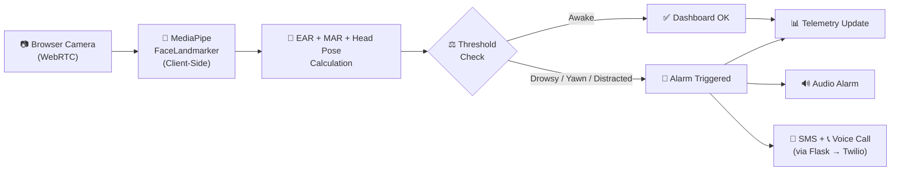
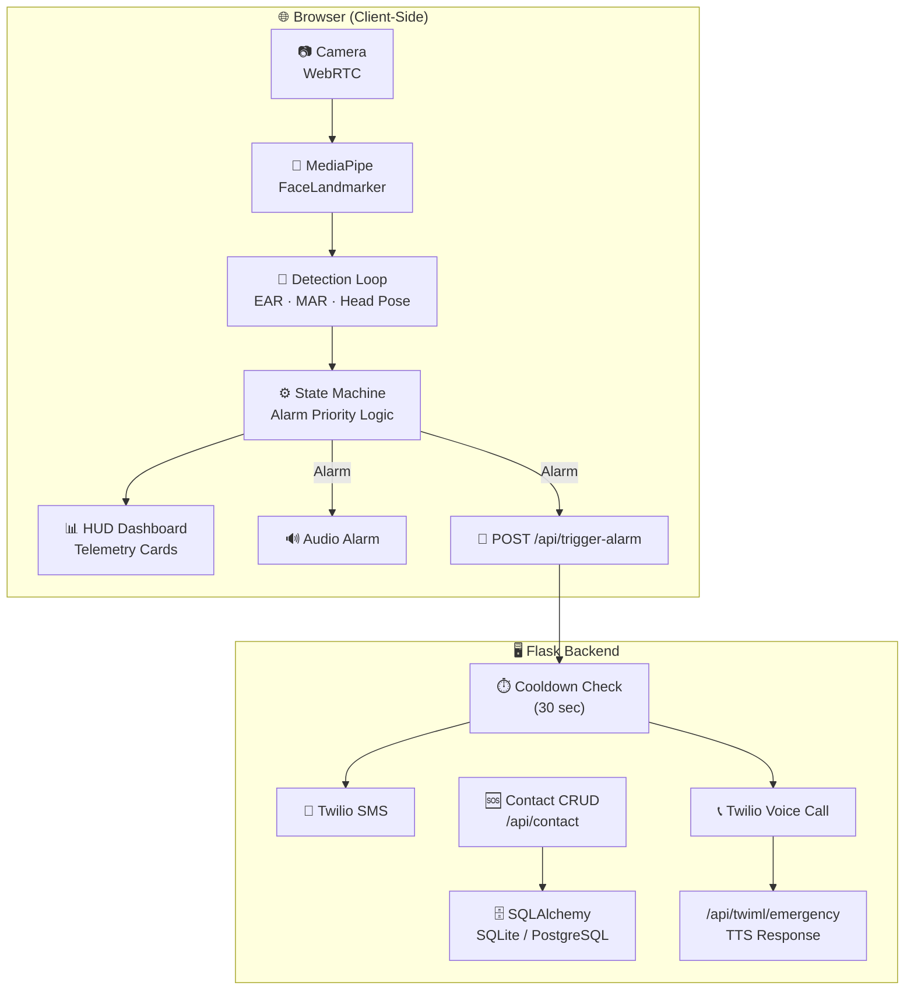

<a name="readme-top"></a>

<div align="center">

# 🚗 AI Driver Drowsiness Detection System

### Real-Time Multi-Signal Fatigue Monitoring — Entirely in the Browser

<br/>

[](https://smart-driver-monitor.onrender.com)
[](https://github.com/yashrajagawane/driver-drowsiness-detection-system/stargazers)

<br/>

[](https://python.org)
[](https://flask.palletsprojects.com)
[](https://ai.google.dev/edge/mediapipe/solutions/vision/face_landmarker)
[](https://www.twilio.com)
[](#-progressive-web-app)
[](https://render.com)

<br/>

[](https://github.com/yashrajagawane/driver-drowsiness-detection-system/issues)
[](https://github.com/yashrajagawane/driver-drowsiness-detection-system/network/members)
[](https://github.com/yashrajagawane/driver-drowsiness-detection-system/commits)
[](CONTRIBUTING.md)

<br/>

> ⚡ **Multi-signal fatigue detection using MediaPipe Face Landmarks, Eye Aspect Ratio (EAR), Mouth Aspect Ratio (MAR), and head pose tracking — all running client-side at 60 FPS.**
> Monitors driver alertness through a live browser camera feed, triggers audio alarms, and escalates to emergency SMS + voice calls via Twilio. No extra hardware required — just a webcam and a browser.

> ⚠️ *Free Render tier may take **30–50 seconds** to spin up on first visit — subsequent loads are fast.*

</div>

---

## 📑 Table of Contents

- [Preview](#️-preview)
- [Why This Project Stands Out](#-why-this-project-stands-out)
- [Key Features](#-key-features)
- [Detection Signals](#-detection-signals)
- [How It Works](#-how-it-works)
- [System Architecture](#-system-architecture)
- [Project Structure](#️-project-structure)
- [Tech Stack](#️-tech-stack)
- [Getting Started](#-getting-started)
- [Environment Variables](#-environment-variables)
- [Deployment on Render](#️-deployment-on-render)
- [Progressive Web App](#-progressive-web-app)
- [Detection Thresholds](#-detection-thresholds)
- [Emergency Escalation Pipeline](#-emergency-escalation-pipeline)
- [License](#-license)
- [Author](#-author)

---

## 🖼️ Preview

<p align="center">
  
</p>

<p align="center">
<b>AI Driver Monitoring Hub — Real-Time HUD Dashboard</b><br>
<i>A dark, futuristic glassmorphism interface with live telemetry cards for EAR, fatigue level, head pose, yawn count, and driver state — powered entirely by client-side MediaPipe AI.</i>
</p>

### 🖥️ Dashboard Overview

- 📷 Click **ENGAGE SYSTEM** to grant camera access and start monitoring.
- 👁️ View the live webcam feed with HUD corner overlays and scan-line animation.
- 📊 Monitor real-time **EAR (Left/Right/Avg)**, **Driver State**, **Fatigue Level**, **Eyes Closed Duration**, **Head Focus**, and **Yawn Count** in the telemetry panel.
- 🆘 Configure an **Emergency Contact** with phone number for automatic SMS and voice call alerts.
- 🚨 When any alarm condition triggers, the system plays an audio alarm and sends an SMS + voice call to the emergency contact via Twilio.
- 📲 Installable as a **Progressive Web App (PWA)** on mobile and desktop.

<p align="right"><a href="#readme-top">back to top ⬆️</a></p>

---

## 🌟 Why This Project Stands Out

| Feature | Description |
|:--------|:------------|
| 🧠 **100% Client-Side AI** | All face detection and fatigue analysis runs in the browser via MediaPipe — zero server-side processing, zero frame uploads. |
| 🔄 **Multi-Signal Detection** | Combines EAR (eye closure), MAR (yawning), head pose (distraction), and cumulative yawn count — not just a single metric. |
| 📱 **Emergency Escalation** | Automatic SMS + voice call to a saved emergency contact via Twilio when an alarm fires. |
| 📲 **Installable PWA** | Works offline as a native-like app on phones and desktops with a service worker. |
| 🎨 **Production-Quality UI** | Dark, futuristic HUD dashboard with glassmorphism, neon accents, and smooth animations. |
| ☁️ **Deploy-Ready** | Ships with `render.yaml` and Gunicorn config — one-click deployment to Render. |
| 🔐 **Privacy First** | Camera frames never leave the device. No cloud AI, no data collection, no tracking. |

<p align="right"><a href="#readme-top">back to top ⬆️</a></p>

---

## ✨ Key Features

<table>
<tr>
<td width="50%">

**👁️ Eye Tracking (EAR)**
- Eye Aspect Ratio algorithm via MediaPipe
- 478-point face mesh landmark detection
- Real-time blink vs. drowsiness classification
- Separate Left / Right / Average EAR display

</td>
<td width="50%">

**🗣️ Yawn Detection (MAR)**
- Mouth Aspect Ratio monitoring
- Leading-edge yawn counting (debounced)
- Cumulative yawn count with alarm threshold
- `> 2 yawns` triggers alarm escalation

</td>
</tr>
<tr>
<td width="50%">

**🧭 Head Pose & Distraction**
- Real-time gaze direction tracking
- Detects: Looking Left, Right, Up, Down
- Sustained distraction triggers alarm
- Visual "Head Focus" indicator

</td>
<td width="50%">

**🚨 Emergency Escalation**
- Audio alarm on any critical detection
- Automatic SMS via Twilio
- Automatic voice call via TwiML TTS
- 30-second backend cooldown prevents spam

</td>
</tr>
<tr>
<td width="50%">

**📊 Live Telemetry Dashboard**
- Real-time FPS counter
- EAR values (L/R/Avg)
- Fatigue level progress bar
- Eyes closed duration timer
- Driver state with color-coded alerts

</td>
<td width="50%">

**📲 Progressive Web App**
- Installable on mobile and desktop
- Offline-capable via service worker
- Cached MediaPipe model + alarm audio
- Native app-like experience

</td>
</tr>
</table>

<p align="right"><a href="#readme-top">back to top ⬆️</a></p>

---

## 🔬 Detection Signals

The system monitors **four independent fatigue signals** simultaneously:

### 1. Eye Aspect Ratio (EAR)

```
EAR = (‖p2 − p6‖ + ‖p3 − p5‖) / (2 × ‖p1 − p4‖)
```

*Where p1–p6 are six facial landmark coordinates around a single eye (MediaPipe face mesh).*

| Status | Condition | Action |
|:------:|:---------:|:------:|
| ✅ **Awake** | EAR ≥ 0.22 | Continue monitoring |
| ⚠️ **Eyes Closing** | EAR < 0.22 (< 1.5s) | Warning state |
| 🚨 **Drowsy Alarm** | EAR < 0.22 for ≥ 1.5 seconds | Full alarm + SMS + voice call |

### 2. Mouth Aspect Ratio (MAR) — Yawn Detection

| Status | Condition | Action |
|:------:|:---------:|:------:|
| ✅ **Normal** | MAR ≤ 0.6 | Continue monitoring |
| ⚠️ **Yawning** | MAR > 0.6 | Yawn counted (debounced) |
| 🚨 **Multiple Yawns** | yawnCount > 2 | Full alarm + SMS + voice call |

### 3. Head Pose — Distraction Detection

| Status | Condition | Action |
|:------:|:---------:|:------:|
| ✅ **Center** | Yaw 0.35–0.65, Pitch 0.35–0.65 | Continue monitoring |
| ⚠️ **Looking Away** | Outside safe zone (< 2.0s) | Warning state |
| 🚨 **Distracted** | Outside safe zone for ≥ 2.0 seconds | Full alarm + SMS + voice call |

### 4. Alarm Priority

The state machine evaluates alarms in strict priority order:

```
Micro-sleep (Drowsy) > Multiple Yawns > Distraction
```

<p align="right"><a href="#readme-top">back to top ⬆️</a></p>

---

## 🧠 How It Works



1. 📷 **Capture** — Browser streams live video via WebRTC (`getUserMedia`)
2. 🧠 **Detect** — MediaPipe FaceLandmarker processes each frame client-side at ~60 FPS
3. 📐 **Calculate** — EAR, MAR, and head yaw/pitch ratios are computed per frame
4. ⚖️ **Evaluate** — The state machine checks all signals against configured thresholds
5. 🚨 **Alarm** — Sustained alerts trigger audio alarm + backend SMS/voice escalation
6. 📊 **Update** — The HUD dashboard reflects real-time driver state, EAR, fatigue %, and more

<p align="right"><a href="#readme-top">back to top ⬆️</a></p>

---

## 🏛️ System Architecture



| Component | Runs On | Purpose |
|:----------|:--------|:--------|
| MediaPipe FaceLandmarker | Browser | 478-point face mesh detection |
| Detection loop (`detect()`) | Browser | EAR, MAR, head pose, state machine |
| Dashboard UI | Browser | Real-time telemetry, HUD, alarms |
| Service Worker | Browser | PWA offline caching |
| Flask `app.py` | Server | Contact CRUD, SMS/Voice trigger, TwiML |
| SQLAlchemy | Server | Emergency contact persistence |
| Twilio | External | SMS delivery + voice call |

<p align="right"><a href="#readme-top">back to top ⬆️</a></p>

---

## 🏗️ Project Structure

```
driver-drowsiness-detection-system/
│
├── 📄 app.py                 # Flask backend — contact CRUD, SMS/Voice trigger, TwiML
├── 🌐 index.html             # Complete PWA frontend — UI, CSS, detection logic, state machine
├── 📋 requirements.txt       # Python dependencies (Flask, Twilio, SQLAlchemy, phonenumbers)
├── ⚙️ render.yaml            # Render cloud deployment config
├── ⚙️ Procfile               # Gunicorn start command for production
├── 🐍 .python-version        # Python version pin (3.12.x)
├── 🔒 .env.example           # Environment variable template (Twilio credentials)
├── 🚫 .gitignore             # Git ignore rules
│
├── 📲 manifest.json          # PWA manifest (app name, icons, display mode)
├── ⚙️ sw.js                  # Service worker (offline caching, MediaPipe model cache)
│
├── 🔊 static/
│   └── alarm.wav             # Drowsiness alert audio file
│
├── 🎨 icons/
│   ├── icon-192.png          # PWA icon (192×192)
│   └── icon-512.png          # PWA icon (512×512)
│
├── 📸 docs/
│   └── screenshots/          # Preview images for README
│
└── 📖 README.md
```

<p align="right"><a href="#readme-top">back to top ⬆️</a></p>

---

## ⚙️ Tech Stack

| Layer | Technology |
|:------|:-----------|
| 🧠 AI / Vision | MediaPipe FaceLandmarker (478-point face mesh, WebAssembly) |
| 🌐 Frontend | HTML · CSS · JavaScript (ES Modules) |
| 🎨 UI Design | Glassmorphism · CSS Variables · Orbitron + Inter + JetBrains Mono |
| 📡 Camera | WebRTC (`getUserMedia`) |
| 🖥️ Backend | Python · Flask · Gunicorn |
| 🗄️ Database | SQLAlchemy (SQLite for dev, PostgreSQL for prod) |
| 📱 SMS / Voice | Twilio REST API + TwiML |
| 📲 PWA | Service Worker · Web App Manifest |
| ☁️ Deployment | Render Cloud |

<p align="right"><a href="#readme-top">back to top ⬆️</a></p>

---

## 🚀 Getting Started

### Prerequisites

- **Python 3.10+** with `pip` and `venv`
- A **webcam** and a modern browser (Chrome, Edge, or Firefox)
- *(Optional)* A [Twilio](https://www.twilio.com) account for SMS + voice call alerts

### 1️⃣ Clone the Repository

```bash
git clone https://github.com/yashrajagawane/driver-drowsiness-detection-system.git
cd driver-drowsiness-detection-system
```

### 2️⃣ Create & Activate a Virtual Environment

```bash
# Create
python -m venv venv

# Activate — Windows
venv\Scripts\activate

# Activate — macOS / Linux
source venv/bin/activate
```

### 3️⃣ Install Dependencies

```bash
pip install -r requirements.txt
```

### 4️⃣ Configure Environment Variables

```bash
# Copy the template
cp .env.example .env

# Edit .env with your Twilio credentials (optional — SMS/Voice won't work without them)
```

### 5️⃣ Run the App

```bash
python app.py
```

### 6️⃣ Open in Browser

```
http://127.0.0.1:5000
```

Click **`ENGAGE SYSTEM`** on the dashboard to grant camera access and start monitoring.

> 💡 **Tip:** The app works fully without Twilio credentials — detection, alarms, and the entire dashboard run without a backend connection. Twilio is only needed for SMS + voice call escalation.

<p align="right"><a href="#readme-top">back to top ⬆️</a></p>

---

## 🔑 Environment Variables

Create a `.env` file from `.env.example`:

| Variable | Required | Description |
|:---------|:--------:|:------------|
| `DATABASE_URL` | No | Database URI. Defaults to `sqlite:///driver.db` for local dev. Use PostgreSQL for production. |
| `FLASK_DEBUG` | No | Set to `1` for hot-reload during development. |
| `TWILIO_ACCOUNT_SID` | For SMS/Voice | Your Twilio Account SID |
| `TWILIO_AUTH_TOKEN` | For SMS/Voice | Your Twilio Auth Token |
| `TWILIO_FROM_NUMBER` | For SMS/Voice | Your Twilio phone number (E.164 format, e.g. `+1234567890`) |

> ⚠️ **Never commit `.env` to Git.** The `.gitignore` already excludes it.

<p align="right"><a href="#readme-top">back to top ⬆️</a></p>

---

## ☁️ Deployment on Render

The project includes a `render.yaml` for one-click deployment:

| Step | Action |
|:----:|:-------|
| 1 | Push your code to GitHub |
| 2 | Create a new **Web Service** on [Render](https://render.com) |
| 3 | Connect your GitHub repository |
| 4 | Render auto-detects `render.yaml` — or manually set: |
|   | **Build Command** → `pip install -r requirements.txt` |
|   | **Start Command** → `gunicorn app:app` |
| 5 | Add environment variables: `TWILIO_ACCOUNT_SID`, `TWILIO_AUTH_TOKEN`, `TWILIO_FROM_NUMBER` |
| 6 | *(Optional)* Attach a PostgreSQL database and set `DATABASE_URL` |
| 7 | Deploy 🚀 |

> 💡 **TwiML Endpoint:** After deploying, update the `tts_url` in `app.py` (line 267) to point to your Render URL:
> ```
> https://your-app-name.onrender.com/api/twiml/emergency
> ```

<p align="right"><a href="#readme-top">back to top ⬆️</a></p>

---

## 📲 Progressive Web App

The application is a fully installable PWA:

- **Installable** — A native install banner appears on supported browsers. Click **INSTALL** to add it to your home screen or desktop.
- **Offline Support** — The service worker (`sw.js`) caches the app shell, MediaPipe model, icons, alarm audio, and fonts for offline use.
- **Standalone Mode** — Runs as a full-screen app without browser chrome when installed.

<p align="right"><a href="#readme-top">back to top ⬆️</a></p>

---

## 🎛️ Detection Thresholds

These values are configured in `index.html` (constants section):

| Parameter | Value | Description |
|:----------|:-----:|:------------|
| `EAR_THRESHOLD` | `0.22` | EAR below this = eyes considered closing |
| `DROWSY_SECONDS` | `1.5` | Seconds of sustained eye closure to trigger DROWSY alarm |
| `MAR_THRESHOLD` | `0.6` | Mouth Aspect Ratio above this = yawn detected |
| `DISTRACT_SECONDS` | `2.0` | Seconds of looking away to trigger DISTRACTED alarm |
| Yawn alarm count | `> 2` | 3rd cumulative yawn triggers MULTIPLE YAWNS alarm |
| Head pose safe zone | `0.35–0.65` | Yaw/pitch ratio range considered "looking forward" |

> 💡 **Tuning tips:**
> - Lower `EAR_THRESHOLD` → fewer false positives from blinking, but may delay detection of genuine drowsiness.
> - Lower `MAR_THRESHOLD` → catches smaller yawns, but may false-trigger on talking.
> - Lower `DISTRACT_SECONDS` → faster distraction alerts, but less tolerance for mirror/shoulder checks.

<p align="right"><a href="#readme-top">back to top ⬆️</a></p>

---

## 🚨 Emergency Escalation Pipeline

When any alarm condition is met, the following pipeline executes:

```
Alarm Triggered
    │
    ├── 🔊 Audio alarm plays (browser)
    │
    └── 📡 POST /api/trigger-alarm (backend)
         │
         ├── ⏱️ Cooldown check (30 sec between escalations)
         │
         ├── 📱 SMS sent via Twilio
         │     └── Emergency alert message to saved contact
         │
         └── 📞 Voice call via Twilio
               └── TTS: "Emergency alert. The AI Driver Monitor has
                    detected possible driver drowsiness. Please contact
                    the driver immediately."
```

| Safeguard | Description |
|:----------|:------------|
| **Frontend debounce** | 10-second cooldown on SMS API calls from the browser |
| **Backend cooldown** | 30-second cooldown between actual Twilio sends |
| **Contact gating** | No action taken if contact is missing or disabled |
| **Independent failures** | Voice call failure does not block SMS delivery |

<p align="right"><a href="#readme-top">back to top ⬆️</a></p>

---

## 🎯 Use Cases

- 🚗 **Personal vehicle** — driver safety monitoring during long trips
- 🚛 **Fleet management** — monitor commercial drivers for fatigue compliance
- 🚘 **Smart vehicles** — ADAS integration prototype
- 🤖 **AI/CV research** — fatigue & attention modeling with MediaPipe
- 🎓 **Education** — hands-on computer vision and real-time detection teaching tool
- 🏥 **Healthcare** — alertness monitoring in clinical or shift-work settings

<p align="right"><a href="#readme-top">back to top ⬆️</a></p>

---

## 🔮 Roadmap

- [x] ~~Eye Aspect Ratio (EAR) drowsiness detection~~
- [x] ~~Real-time HUD dashboard with live telemetry~~
- [x] ~~Yawn detection via Mouth Aspect Ratio (MAR)~~
- [x] ~~Head pose / gaze distraction detection~~
- [x] ~~Emergency SMS alerts via Twilio~~
- [x] ~~Emergency voice calls via Twilio TwiML~~
- [x] ~~PWA support with offline caching~~
- [x] ~~Emergency contact management UI~~
- [ ] 🌙 Day / Night driving mode profiles
- [ ] 📊 Session-based drowsiness reports & analytics
- [ ] 📱 Mobile-optimized responsive layout
- [ ] 👥 Multi-driver detection support
- [ ] 🧠 Deep learning-based fatigue classification
- [ ] 🔔 Push notification channel
- [ ] 📈 Historical trip data and trends

Have an idea? Open an issue or start a discussion — contributions are welcome.

<p align="right"><a href="#readme-top">back to top ⬆️</a></p>

---

## 🤝 Contributing

Contributions make the open-source community a great place to learn and build. Any contribution is **greatly appreciated**.

1. Fork the repository
2. Create your feature branch (`git checkout -b feature/AmazingFeature`)
3. Commit your changes (`git commit -m 'Add some AmazingFeature'`)
4. Push to the branch (`git push origin feature/AmazingFeature`)
5. Open a Pull Request

Don't forget to ⭐ **star the repo** if you found it useful!

<p align="right"><a href="#readme-top">back to top ⬆️</a></p>

---

## ❓ FAQ

**Does it work with glasses?**
MediaPipe's face mesh model handles glasses well in most cases. Heavy glare or reflective lenses in bright light can reduce landmark accuracy — good, even lighting helps.

**Does it need internet access?**
For the core detection: **No.** Once the page loads and the MediaPipe model is cached by the service worker, all AI processing runs offline. Internet is only needed for Twilio SMS/voice call escalation and initial model download.

**Is my camera data uploaded anywhere?**
**No.** All video frames are processed locally in the browser via MediaPipe WebAssembly. Nothing is sent to any server — the Flask backend only handles contact management and Twilio API calls.

**Can I use it on mobile?**
Yes — install it as a PWA from Chrome on Android. iOS Safari has limited PWA support but the web app still works in-browser.

**Why does the free Render demo take so long to load?**
Render's free tier spins down idle services; the first request after inactivity "wakes" the server, which takes roughly 30–50 seconds.

**Can I use it without Twilio?**
Absolutely. The entire detection, alarm, and dashboard system works without Twilio. You just won't receive SMS or voice call notifications — the audio alarm still plays locally.

<p align="right"><a href="#readme-top">back to top ⬆️</a></p>

---

## ⚠️ Disclaimer

This project is a research and educational prototype demonstrating real-time drowsiness detection with computer vision. It is **not a certified safety device** and has not been validated against automotive safety standards. It should be treated as a supplementary tool at most — never as a driver's sole line of defense against fatigue while on the road.

<p align="right"><a href="#readme-top">back to top ⬆️</a></p>

---

## 📄 License

This project does not yet declare a license. If you intend for others to freely use, modify, or contribute to it, consider adding a [LICENSE](https://choosealicense.com/) file — the [MIT License](https://choosealicense.com/licenses/mit/) is a common, permissive choice for open-source projects like this one.

<p align="right"><a href="#readme-top">back to top ⬆️</a></p>

---

<div align="center">

## 👨‍💻 Author

**Yashraj Agawane**

[](https://github.com/yashrajagawane)

---

### ⭐ Found this helpful?

**Star the repo** — it takes one click and means a lot, and helps others discover the project too!

[](https://github.com/yashrajagawane/driver-drowsiness-detection-system)

<br/>

*Built with ❤️ to make roads safer*

</div>
